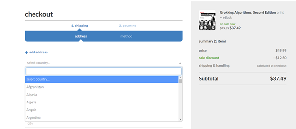
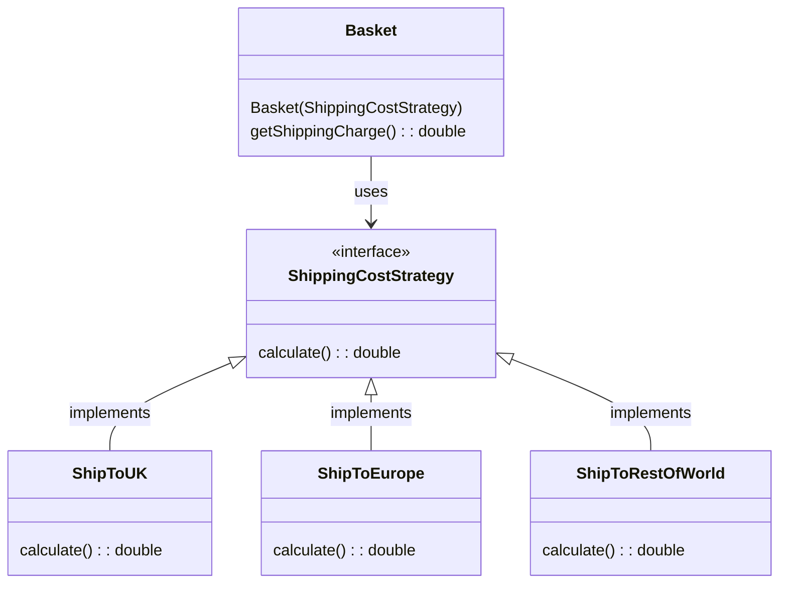

# Software Design and Architecture Week03 Lab 02 Worksheet

# Implement a Strategy Pattern for Calculating Shipping Costs



The implementation of a simple book shopping site uses this class to represent the product

```java
import java.util.Objects;

class Product {

    private final String itemCode;
    private final String name;
    private final double weight;

    public Product(String itemCode, String name, double weight) {
        this.itemCode = itemCode;
        this.name = name;
        this.weight = weight;
    }

    public String getItemCode() {
        return itemCode;
    }

    public String getName() {
        return name;
    }

    public double getWeight() {
        return weight;
    }

    @Override
    public boolean equals(Object o) {
        if (!(o instanceof Product product)) return false;
        return Objects.equals(itemCode, product.itemCode);
    }

    @Override
    public int hashCode() {
        return Objects.hashCode(itemCode);
    }

    @Override
    public String toString() {
        return "Product{" +
                "itemCode='" + itemCode + '\'' +
                ", name='" + name + '\'' +
                '}';
    }
}

```

The code to calculate the shipping charge is in the Basket class and is based on a Destination.

```java
enum Destination {
    UK,
    Europe,
    RestOfWorld
}
```

```java
import java.util.ArrayList;
import java.util.List;

class Basket {
    private final List<Product> products = new ArrayList<>();
    private final Destination shipTo;


    public Basket(Destination shipTo) {
        this.shipTo = shipTo;
    }

    public void addProduct(Product product) {
        products.add(product);
    }

    public void removeProduct(Product product) {
        products.remove(product);
    }

    private double totalWeight()
    {
        double weight = 0.0d;
        for(Product product: products)
        {
            weight += product.getWeight();
        }
        return weight;
    }

    public double getShippingCharge()
    {
        return switch( shipTo) {
            case UK -> 0.0d; //Free Shipping in UK
            case Europe -> totalWeight() * 1.25; //£1.25 per Kg
            default -> switch (products.size()) //Rest of the World
            {
                case 0 -> 0.0d;
                default -> Math.max(10.00d, totalWeight() * 5.50); // higher of £10.00 or 5.50 per Kg
            };
        };
    }

}

```

An example usage for our basket class, in this case shipping to ROW.

```java
Product book1 = new Product("ABC123", "Agile Principles, Patterns, and Practices in Java", 1.02);
Product book2 = new Product("DEF456", "The Pragmatic Programmer", 0.62);
Product book3 = new Product("GHI789", "Refactoring : improving the design of existing code", 2.03);

Basket basket = new Basket(Destination.RestOfWorld);
basket.addProduct(book1);
System.out.format("Shipping %f%n", basket.getShippingCharge());

basket.addProduct(book2);
System.out.format("Shipping %f%n", basket.getShippingCharge());

basket.addProduct(book3);
System.out.format("Shipping %f%n", basket.getShippingCharge());

basket.removeProduct(book2);
System.out.format("Shipping %f%n", basket.getShippingCharge());
```

The lab task is to replace the Destination enum parameter with a Strategy Pattern, with 3 concrete strategies representing UK Shipping, Europe Shipping and Rest of World Shipping.

## Hints and Tips

The shipping cost calculation in the original code is an example of an algorithm. Algorithm is the term given to any sequence of steps to solve a problem, make a decision or calculate a value.

The shipping cost algorithm is the thing that is varying – extract it out of the Basket code and encapsulate each different calculation (algorithm) into its own class with a common interface (encapsulation).

You are looking to implement this arrangement.

The ShippingCostStrategy will be an interface that looks something like this in Java.



```java
interface ShippingCostStrategy {
    double calculate (List<Product> products);
}
```

Once you have this working, convert your solution to use the ShippingCost Value Object you produced in the first exercise (replacing the double primitive type with a Value Object).

# Implement the Bridge Pattern (Advanced)

The **More Ways of Handling Variation** chapter of the module textbook introduces the **Bridge** pattern.

Implement the example given that deals with Product and ProductPrinter using the code provided in the Variations project (bridgeproduct package) in the Student code repo (you will need to get the code from the module GitHub repository if you do not have it already).

All the code is provided, the objective of this advanced lab exercise to understanding how the pattern works.

Although usage of the Bridge pattern is not as common as the strategy pattern, it does solve some difficult design problems, so there is value in being aware of the pattern.

# Identify Candidate Classes for the Simple Frustration Game.

The assessment task is to write a simulation of a prototype physical board game called “Simple Frustration”. Full details are in the assessment brief in Moodle and there is a demo in Lecture 1 that shows an example simulation.

This lab exercise provides some time to identify some possible classes that model the key concepts and relationships within the game

• Entities: Things that represent important concepts or objects in the game

• Attributes: The “data” in Entities, either as primitives or (better) Value Objects

• Relationships between the classes

Some Kinds of classes

• Knowing: Knows and provides information (mostly holding data)

• Service Providing: Performs work on behalf of others (calculations, sending emails)

• Controlling: Makes decisions and delegates to other objects.

The Game also requires several variations. Identify the variations and how you might solve them using Strategies.

Use the lab time to get feedback from the tutors on you candidate classes.

