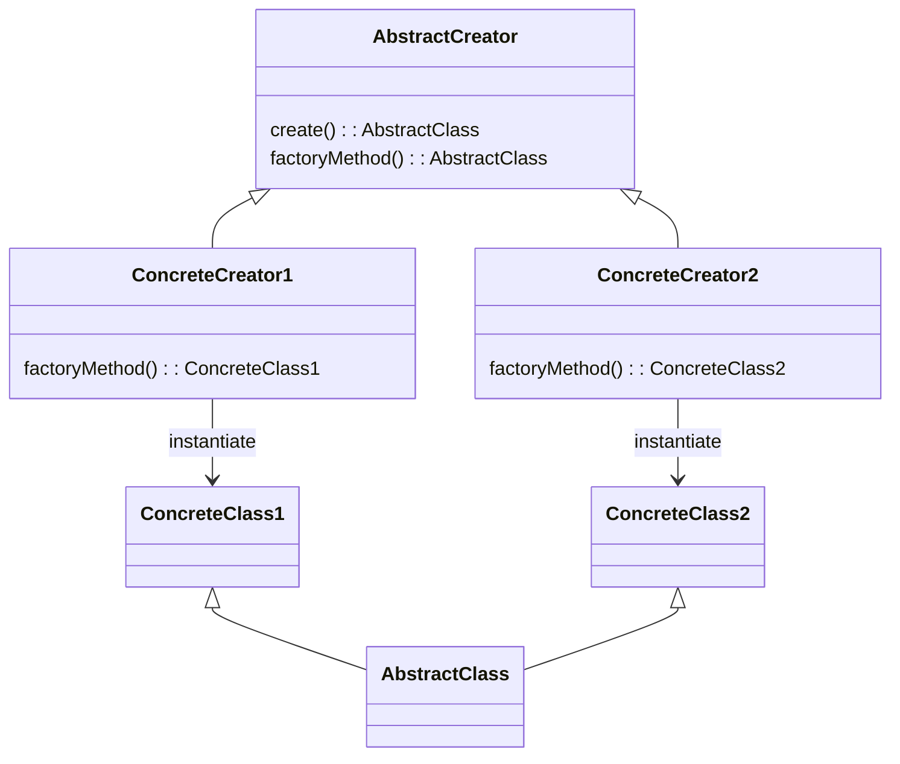

# Software Design and Architecture Week04 Lab 02 Worksheet

# Write a Money Factory using the Abstract Factory pattern.

We could be writing an e-commerce application that will be used in multiple countries. We therefore want to have the concept of Money using different currencies, but we don’t need to mix currencies within a single deployment of our e-commerce application.

Create a Money Value Object that combines a value with the Currency class from the earlier part of the lab.

```java
class Money {

    private final double amount;
    private final Currency currency;

    public Money(double amount, Currency currency) {
        this.currency = currency;
        double factor = Math.pow(amount, currency.getDecimals());
        this.amount = Math.round(amount * factor)/factor; //round to the number of currency decimals
    }

    public double getAmount() {
        return amount;
    }

    public Currency getCurrency() {
        return currency;
    }

    @Override
    public boolean equals(Object o) {
        if (!(o instanceof Money money)) return false;
        return Double.compare(amount, money.amount) == 0 && Objects.equals(currency, money.currency);
    }

    @Override
    public int hashCode() {
        return Objects.hash(amount, currency);
    }

    @Override
    public String toString() {
        //create a format string such as ".2f" to display a double to a number of decimals
        String formatString = String.format(".%df", currency.getDecimals());
        return currency.getSymbol() + String.format("%" + formatString , amount);
    }
}

```

Create a MoneyFactory interface

```java
interface MoneyFactory {
  public Money create(double amount);
}

```

Write concrete implementations of this interface for GBP, EUR and USD currencies called GbpMoneyFactory, EurMoneyFactory and UsdMoneyFactory so that this test program code gives the following output.
```text
createMoney(new EurMoneyFactory());
createMoney(new UsdMoneyFactory());
createMoney(new GbpMoneyFactory());

private static void createMoney( MoneyFactory moneyFactory) {
    System.out.format("%s%n", moneyFactory.create(10d));
    System.out.format("%s%n", moneyFactory.create(10.9999d));
    System.out.format("%s%n", moneyFactory.create(0.9999d));
}


Outputs
€10.00
€11.00
€1.00
$10.00
$11.00
$1.00
£10.00
£11.00
£1.00

```
## Hints and Tips

See the lecture notes and module textbook for a discussion of patterns for creating objects.

By changing the concrete type providing the MoneyFactory interface, we can make a single change so that all Money objects created in the program (in our case the createMoney method) have the required currency.

Your concrete factories should use the Currency Singletons you created in the first part of the lab. This is because although we might create millions of instances of Money with different values, but don’t want to create millions of unnecessary instances of Currency.

# Write a Money Creator using a Factory Method (Advanced)

Another common creation pattern is the **Factory Method** pattern. The Factory Method creates objects in a superclass but allows subclasses to alter the type of objects that will be created. It is slightly more complex than the Abstract Factory pattern, but a bit more flexible because it can run code before and after the concrete class is created.

Read the **Factory Method Pattern** section in the module textbook and re-implement the MoneyFactory example using a Factory method.

## Hints and Tips

The general form of the **Factory Method** pattern.

Assume we want to make different concrete classes inherited from an abstract superclass

```java
abstract class AbstractClass {
    public abstract void operation();
}
class ConcreteClass1 extends AbstractClass {
    @Override
    public void operation() {
    }
}
class ConcreteClass2 extends AbstractClass {
    @Override
    public void operation() {
    }
}
```

We make an AbstractCreator which has a `public create()` method and an `abstract protected factoryMethod()`.

Concrete subclasses of the AbstractCreator implement `factoryMethod()` to create concrete classes.

The public `create()` method can contain any common code (if any) that runs before or after the requested object is made and before it is returned to the client.

```java
abstract class AbstractCreator {
    public AbstractClass create()
    {
        return factoryMethod();
    }
    protected abstract AbstractClass factoryMethod();
}
class ConcreteCreator1 extends AbstractCreator {

    @Override
    protected ConcreteClass1 factoryMethod() {
        return new ConcreteClass1();
    }
}
class ConcreteCreator2 extends AbstractCreator {
    @Override
    protected ConcreteClass1 factoryMethod() {
        return new ConcreteClass1();
    }
}

```

As a UML diagram.



Write concrete implementations of an abstract MoneyCreator class for GBP, EUR and USD currencies called GbpMoneyCreator, EurMoneyCreator and UsdMoneyCreator so that this test program code gives the following output.
```text
    createMoney(new EurMoneyCreator());
    createMoney(new UsdMoneyFactory());
    createMoney(new GbpMoneyCreator());

private static void createMoney( AbstractMoneyCreator moneyCreator) {
    System.out.format("%s%n", moneyCreator.create(10d));
    System.out.format("%s%n", moneyCreator.create(10.9999d));
    System.out.format("%s%n", moneyCreator.create(0.9999d));
}
Outputs:
€10.00
€11.00
€1.00
$10.00
$11.00
$1.00
£10.00
£11.00
£1.00
```

**Question**: What are the differences between the Abstract Factory and Factory Method patterns. When would you use one over the other?

# Identify Candidate Classes for the Simple Frustration Game.

If you have time continue to think about the Simple Frustration game.

The assessment task is to write a simulation of a prototype physical board game called “Simple Frustration”. Full details are in the assessment brief in Moodle and there is a demo in Lecture 1 that shows an example simulation.

This lab exercise provides some time to identify some possible classes that model the key concepts and relationships within the game

• Entities: Things that represent important concepts or objects in the game

• Attributes: The “data” in Entities, either as primitives or (better) Value Objects

• Relationships between the classes

Some Kinds of classes

• Knowing: Knows and provides information (mostly holding data)

• Service Providing: Performs work on behalf of others (calculations, sending emails)

• Controlling: Makes decisions and delegates to other objects.

The Game also requires several variations. Identify the variations and how you might solve them using Strategies.

Use the lab time to get feedback from the tutors on your candidate classes.
