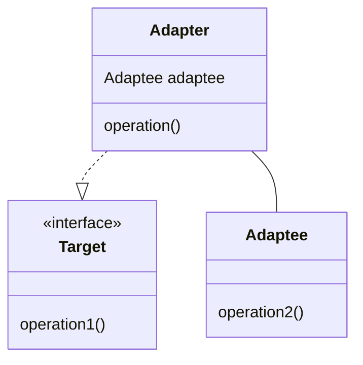

# Software Design and Architecture Week08 Lab 01 Worksheet

# Apply the Dependency Inversion Principle (DIP)

In this lab, you are going to use the Dependency Inversion Principle (DIP) to refactor a simple application that interacts with an external system through a `Gateway`.

A `Gateway` is an object that encapsulates access to an external system or resource, such as a database, web service, or file system (Fowler, 2002 p. 466).
You have been provided with two Gateway implementations: `DefaultCourierGateway` and `AlternativeCourierGateway`. These classes simulate interaction with different courier (parcel delivery) services, and would be used in a real application to send and receive data from the respective courier service REST APIs and have been written by someone else in your team.

Parcel courier services charge different rates depending on how fast you want your parcel to be delivered, the faster the delivery, the more expensive the service.

The DefaultCourier Gateway implementation requires the parcel weight in grams and the number of delivery days as parameters to the `send` method.

```java
public class DefaultCourierGateway{
    public void send(double weightInGrams, int deliveryDays) {
        // Implementation for shipping a parcel via the default courier
        System.out.format("Shipping parcel %fg via Default Courier in %d days%n", weightInGrams, deliveryDays);
    }
}
```
Copy this into a new project in a Java package called `defaultcourier`.

The AlternativeCourier Gateway implementation requires the parcel weight in kilograms and a service type specified. The service type is specified using an enum defined by the Gateway.

```java
public enum AlternativeCourierService {
    PRIORITY_OVERNIGHT, STANDARD, ECONOMY
}
public class AlternativeCourierGateway {
    public void shipPackage(double weightInKg, AlternativeCourierService service) {
        // Implementation for shipping a parcel via AlternativeCourier
        System.out.println(String.format("Shipping parcel %fkg to via Alternative Courier %s service", weightInKg, service.name()));
    }
}
```

Copy this into a new project in a Java package called `alternativecourier`.

Your team has written an Order class that represents an order to be shipped. Note that in our ECommerce system, our Order class uses imperial pounds (lbs) as the weight unit (it's an old system), so you will need to convert the weight to the appropriate unit required by each Gateway implementation.

When the `OrderWithoutDip` class is constructed, we pass in the parcel weight in lbs, the delivery option (an enum defined below) selected by the customer, and a boolean flag indicating which Gateway implementation to use (there will be some system setting that defines if we are using the default or alternative courier that day).


```java
public enum DeliveryOption {
    NEXT_DAY, //Deliver the next day
    STANDARD, //2-3 days
    BUDGET, //5 days or more
}

public class OrderWithoutDip {
    private final double weightInLbs;
    private final DeliveryOption option;
    private final boolean useDefaultDeliveryCourier;
    private final DefaultCourierGateway defaultCourier;
    private final AlternativeCourierGateway alternativeCourier;

    public OrderWithoutDip(double weightInLbs, DeliveryOption option, boolean useDefaultDeliveryCourier) {
        this.weightInLbs = weightInLbs;
        this.option = option;
        this.useDefaultDeliveryCourier = useDefaultDeliveryCourier;
        this.defaultCourier = new DefaultCourierGateway();
        this.alternativeCourier = new AlternativeCourierGateway();
    }

    private static double convertLbsToKg(double lbs) {
        return lbs * 0.453592d;
    }

    public void ship() {
        if (useDefaultDeliveryCourier) {
            //  Default Courier uses grams as weight unit and days as delivery time unit
            double weightInGrams = convertLbsToKg(weightInLbs) * 1000d;
            int deliveryTimeInDays = switch (option) {
                case NEXT_DAY -> 1;
                case STANDARD -> 3;
                case BUDGET -> 5;
            };
            defaultCourier.send(weightInGrams, deliveryTimeInDays);
        } else {
            //  Alternative Courier uses kgs as weight unit, and we need to choose a service level based on selected DeliveryOption
            double weightInKgs = convertLbsToKg(weightInLbs);
            AlternativeCourierService service = switch (option) {
                case NEXT_DAY -> AlternativeCourierService.PRIORITY_OVERNIGHT;
                case STANDARD -> AlternativeCourierService.STANDARD;
                case BUDGET -> AlternativeCourierService.ECONOMY;
            };
            alternativeCourier.shipPackage(weightInKgs, service);
        }
    }
}
```
Some example code that uses the Order class:

```java
double parcel1 = 2.5; // lbs
double parcel2 = 10.0; // lbs

// Use the DefaultCourier
OrderWithoutDip orderWithoutDip1 = new OrderWithoutDip(parcel1, DeliveryOption.NEXT_DAY, true);
orderWithoutDip1.ship();

// Use the AlternativeCourier
OrderWithoutDip orderWithoutDip2 = new OrderWithoutDip(parcel2, DeliveryOption.BUDGET, false);
orderWithoutDip2.ship();
```
Outputs messages such as

```Text
Shipping parcel 1133.980000g via Default Courier in 1 days
Shipping parcel 4.535920kg to via Alternative Courier STANDARD service
```
The lab task is to refactor the `OrderWithoutDip` class into a new class called OrderWithDip making use of the Dependency Inversion Principle. You will need to identify the external dependencies and apply the Dependency Inversion Principle (DIP) to decouple the Order class from the concrete Gateway implementations.

## Hints and Tips
In the `OrderWithoutDip` class, the Order class is a higher level module that depends on lower-level modules (the Gateway implementations). The `ship` method is higher in the call stack than the calls to the Gateway methods. In the language of Dependency Inversion, the Order is the Policy, and the Gateway implementations are the Details.
The package containing OrderWithDip also depends on the two Gateway packages (defaultcourier and alternativecourier).

1. Examine the `OrderWithoutDip` class and design a Java interface that represents a contract for shipping a parcel from the point of view of the Order class. This interface should define a method for shipping a parcel, with parameters that are independent of the specific Gateway implementations and be placed in the same Java package as your new OrderWithDip class.
2. You will then need to create two classes, one for each Gateway implementation. Each class will implement the interface you defined in step 1 and will internally use the respective Gateway implementation to perform the shipping operation.
3. These classes are technically **Adapter** classes that handle any necessary conversions or mappings between the interface you defined and the specific requirements of the Gateway implementations.
4. Put the Gateway adapter class for the DefaultCourierGateway into the `defaultcourier` Java package and the Gateway adapter class for the AlternativeCourierGateway into the `alternativecourier` Java package.

An **Adapter** class is a design pattern that allows objects with incompatible interfaces to work together.

In its general form, an **Adapter** adapts an **Adaptee** to a **Target** interface.



In this case your code implements one interface (in this case the one you have defined) and adapts it to the calls to the methods of another class (the Gateway implementations) (Gamma et al., 1995 p. 139). We discuss this pattern in the Dependencies chapter of the online textbook.

If you have completed the lab successfully, the dependency graph should have changed from:

- `OrderWithoutDip` *depends on* `DefaultCourierGateway`, and `imports` the `defaultcourier` package
- `OrderWithoutDip` *depends on* `AlternativeCourierGateway`, and `imports` the `alternativecourier` package

to:

- `OrderWithDip` *depends on* your interface.
- `DefaultCourierGatewayAdapter` *depends on* your interface and `imports` the package containing your interface.
- `AlternativeCourierGatewayAdapter` *depends on* your interface and imports the package containing your interface.

In other words, everything depends on the abstract interface (the abstraction). Recall the definition of the Dependency Inversion Principle from Martin and Martin (2007 p 154):

- High-level modules should not depend on low-level modules. Instead, they should depend on abstractions.
- Abstractions should not depend on details. Details should depend on abstractions.

## Compare the application of the Dependency Inversion Principle (DIP) to the Strategy pattern. (Advanced)

Consider how the application of the Dependency Inversion Principle (DIP) in this lab compares to the Strategy pattern you implemented earlier in the module.
