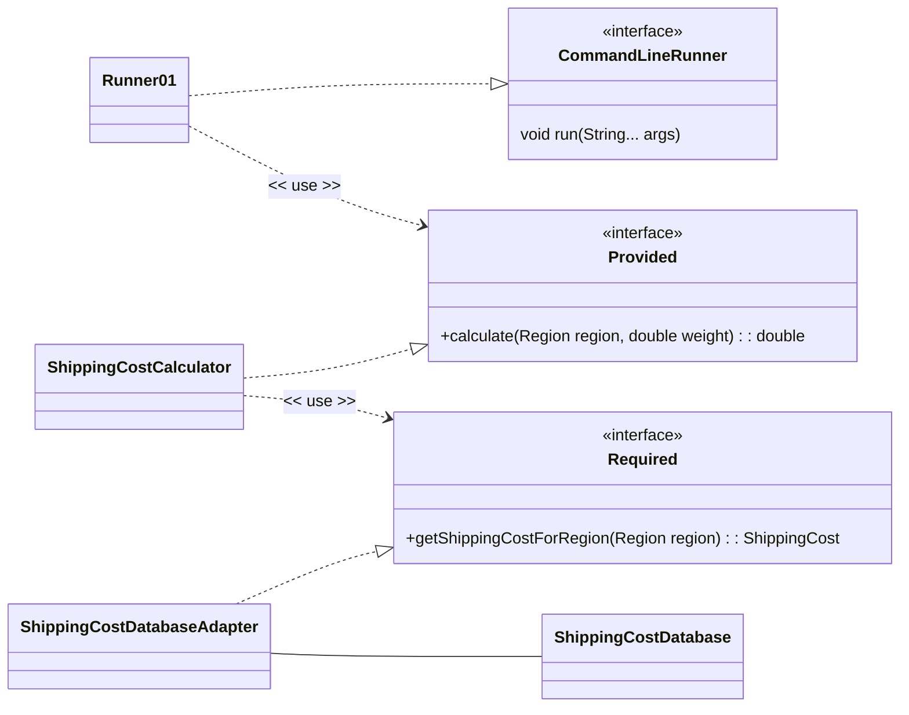

# Software Design and Architecture Week09 Lab 01 Worksheet


# Convert a Ports and Adapters architecture to Spring

This lab will set up a basic Spring Boot application that uses Dependency Injection to manage a Ports and Adapters architecture.

> ⚠ This lab assumes you have completed the Spring Framework and Dependency Injection (DI) lab in a Week08 and are familiar with creating and running Spring Boot applications in IntelliJ.
> If you have not done so, please complete that lab first.

## Set up a Spring Boot Application

We are going to create a simple Spring Boot application using the **Spring Initializr** web tool.

Go to the website https://start.spring.io create a starter project using the following settings

- **Project**: Maven
- **Language**: Java
- **Spring Boot**: Choose latest stable (at time of writing this was 3.5.7)
- **Project Metadata**
    - Group: uk.ac.mmu
    - Artifact: lab0901
    - Name: lab0901
    - Description: Ports and Adapters in Spring
    - Package name: uk.ac.mmu.lab0901
    - Packaging: Jar
    - Configuration: Properties
    - Java: 21 (choose 21 if you are working on a University computer, otherwise choose 24 or higher)
- **Dependencies**: No dependencies are required for this lab.

Click the "Generate" button to download a zip file containing the starter project. Unzip the file and open the project in IntelliJ (be careful to open the project at the right level - the project should be opened from the directory containing the pom.xml file).

> ☠ Do not attempt to put Spring Boot projects into existing IntelliJ projects. Always create a new project for Spring Boot applications. This is because Spring Boot projects have a specific structure and configuration and use a build system called **Maven** that will conflict with existing projects.

A successful build and run should display the Spring Boot startup messages in the console (something like)

```Text
.   ____          _            __ _ _
 /\\ / ___'_ __ _ _(_)_ __  __ _ \ \ \ \
( ( )\___ | '_ | '_| | '_ \/ _` | \ \ \ \
 \\/  ___)| |_)| | | | | || (_| |  ) ) ) )
  '  |____| .__|_| |_|_| |_\__, | / / / /
 =========|_|==============|___/=/_/_/_/

 :: Spring Boot ::                (v3.5.7)

uk.ac.mmu.lab0901.Lab0901Application     : Starting Lab0901Application
uk.ac.mmu.lab0901.Lab0901Application     : No active profile set, falling back to 1 default profile: "default"
uk.ac.mmu.lab0901.Lab0901Application     : Started Lab0901Application in 1.17 seconds (process running for 1.545)

```

> ⚠ The details of your banner may vary depending on the date, version of Spring Boot, project settings, and other factors

Now create a class that implements the `org.springframework.boot.CommandLineRunner` and `org.springframework.core.Ordered` interfaces

```Java
package uk.ac.mmu.lab0901;

import org.springframework.core.Ordered;
import org.springframework.stereotype.Component;

@Component
class Runner01 implements org.springframework.boot.CommandLineRunner, org.springframework.core.Ordered
{
    Runner01() {

    }


    @Override
    public void run(String... args)  {
        System.out.format("Hello from %s%n", this.getClass());
    }

    @Override
    public int getOrder() {
        return org.springframework.core.Ordered.HIGHEST_PRECEDENCE;
    }
}
```
You should see the message `Hello from uk.ac.mmu.lab0901.Runner01` appear in the console when you run the application. This shows that the Spring Boot application is running correctly.

## Creating a Shipping Cost Calculator application in Spring Boot

Copy the `applicationcode` and `infrastructure` packages from the **ShippingCostPortsAdaptors** project in Student code repository to the `uk.ac.mmu.lab0901` package in your Spring Boot project.

Wire up the Spring Boot application to use the Shipping Cost Calculator code.

### Hints and Tips

You will need to change the package declarations at the top of each Java file to reflect the new package location and change imports as necessary.

The `Runner01` class will need to be modified to create and use an instance of the `Provided` instance (realized by `ShippingCostCalculator`). It needs to become a driving adapter for the application and located in the `infrastructure` package.



If this is done successfully, when you run the Spring Boot application, you should see output similar to the following in the console

```Text
uk.ac.mmu.lab0901.Lab0901Application     : Started Lab0901Application in 1.281 seconds (process running for 1.69)
Select a region to ship to (UK, EUR, ROW): ROW
Enter the weight of the package in kg: 10
Shipping cost to ROW: 55.000000
```

There should be no need to modify any of the code in the `applicationcode` package, thus demonstrating the separation of concerns provided by the Ports and Adapters architecture that allows us to put a driving or driven adapter on to the same application code.

## Extension Lab (Advanced)

- Create a dummy implementation of the `Provided` interface, configure the Spring Boot application to use this dummy implementation. Demonstrate that the application still works.
- Create an alternate implementation of the `Required` interface, configure the Spring Boot application to use this dummy implementation. Demonstrate that the application still works.

