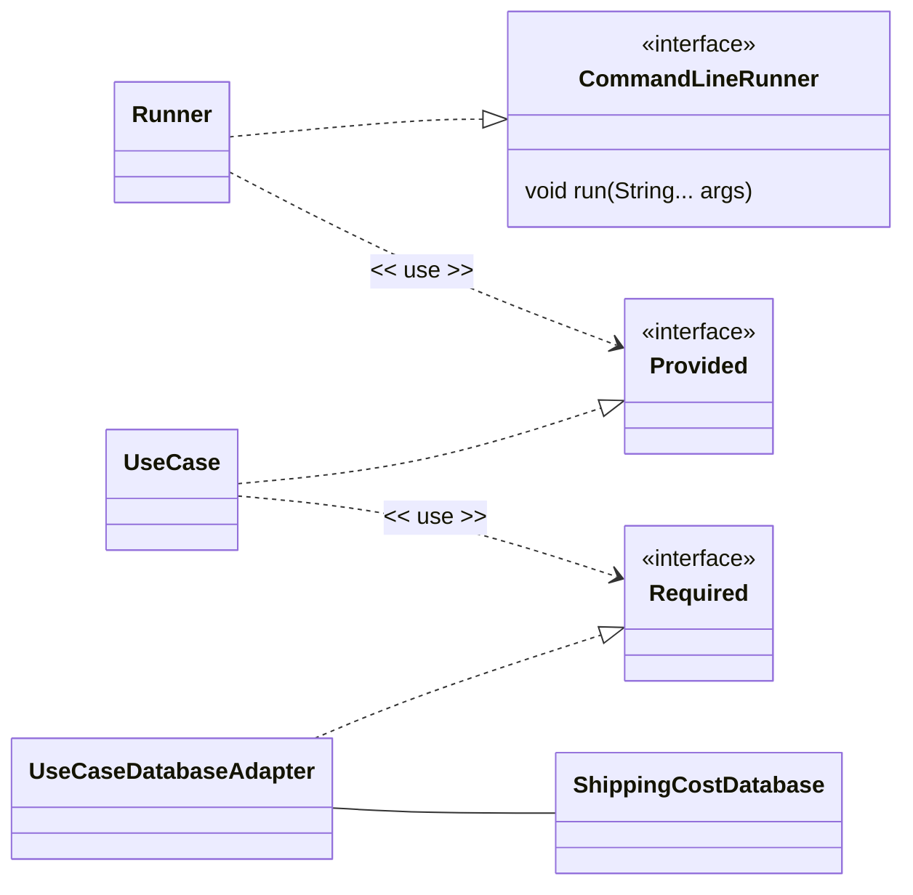

# Software Design and Architecture Week10 Lab 01 Worksheet


# Convert a Clean architecture to Spring

This lab will set up a basic Spring Boot application that uses Dependency Injection to manage a Clean architecture.

> ⚠ This lab assumes you have completed the Spring Framework and Dependency Injection (DI) lab in a Week08 and are familiar with creating and running Spring Boot applications in IntelliJ.
> If you have not done so, please complete that lab first.

## Set up a Spring Boot Application

We are going to create a simple Spring Boot application using the **Spring Initializr** web tool.

Go to the website https://start.spring.io create a starter project using the following settings

- **Project**: Maven
- **Language**: Java
- **Spring Boot**: Choose latest stable (at time of writing this was 3.5.7)
- **Project Metadata**
    - Group: uk.ac.mmu
    - Artifact: lab1001
    - Name: lab1001
    - Description: Clean Architecture in Spring
    - Package name: uk.ac.mmu.lab1001
    - Packaging: Jar
    - Configuration: Properties
    - Java: 21 (choose 21 if you are working on a University computer, otherwise choose 24 or higher)
- **Dependencies**: No dependencies are required for this lab.

Click the "Generate" button to download a zip file containing the starter project. Unzip the file and open the project in IntelliJ (be careful to open the Project at the right level - the project should be opened from the directory containing the pom.xml file).

> ☠ Do not attempt to put Spring Boot projects into existing Intelli-J projects. Always create a new project for Spring Boot applications. This is because Spring Boot projects have a specific structure and configuration and uses a build system called **Maven** that will conflict with existing projects.

A successful build and run should display the Spring Boot startup messages in the console (something like)

```Text
.   ____          _            __ _ _
 /\\ / ___'_ __ _ _(_)_ __  __ _ \ \ \ \
( ( )\___ | '_ | '_| | '_ \/ _` | \ \ \ \
 \\/  ___)| |_)| | | | | || (_| |  ) ) ) )
  '  |____| .__|_| |_|_| |_\__, | / / / /
 =========|_|==============|___/=/_/_/_/

 :: Spring Boot ::                (v3.5.7)

uk.ac.mmu.lab1001.Lab1001Application     : Starting Lab1001Application
uk.ac.mmu.lab1001.Lab1001Application     : No active profile set, falling back to 1 default profile: "default"
uk.ac.mmu.lab1001.Lab1001Application     : Started Lab1001Application in 1.248 seconds (process running for 1.635)

```

> ⚠ The details on your banner may vary depending on the date, version of Spring Boot, project settings and other factors

Now create a class that implements the `org.springframework.boot.CommandLineRunner` and `org.springframework.core.Ordered` interfaces

```Java
package uk.ac.mmu.lab0901;

import org.springframework.core.Ordered;
import org.springframework.stereotype.Component;

@Component
class Runner01 implements org.springframework.boot.CommandLineRunner, org.springframework.core.Ordered {

    Runner01() {

    }


    @Override
    public void run(String... args)  {
        System.out.format("Hello from %s%n", this.getClass());
    }

    @Override
    public int getOrder() {
        return org.springframework.core.Ordered.HIGHEST_PRECEDENCE;
    }
}
```
You should see the message `Hello from class uk.ac.mmu.lab1001.Runner01` appear in the console when you run the application.

## Creating a Shipping Cost Calculator application in Spring Boot

Copy the `applicationcode` and `infrastructure` packages from the **ShippingCostCleanArchitecture** project in Student code repository to the `uk.ac.mmu.lab1001` package in your Spring Boot project.

Wire up the Spring Boot application to use the Shipping Cost Calculator code.

 ### Hints and Tips

You will need to change the package declarations at the top of each Java file to reflect the new package location and change imports as necessary.

The `Runner` class (the class that implements the org.springframework.boot.CommandLineRunner and org.springframework.core.Ordered interfaces) will need to be modified to create and use a the `Provided` instance. It needs to become a driving adapter for the application and be located in the infrastructure package.



If all is well, when the application is run you should see output similar to

```Text
Calculate Shipping using calculate method:
Select a country to ship to (DE,NZ,VA,RO,DK,RS,RU,AD,ZA,AL,SE,HR,SI,HU,EE,AT,AU,SK,SM,LI,LT,LU,LV,IE,ES,BA,BE,BG,PL,IN,PT,MC,MD,ME,IS,IT,BR,MK,FI,BY,MT,FR,CA,MX,CH,UA,JP,CN,GB,NL,CY,NO,US,CZ,GR): GR
Enter the weight of the package in kg: 98
Shipping cost to GR: 122.500000

```

### Initializing the Database

In the original code we wrote a `ShippingCostDatabaseInitializer` class that executed the applicationcode.usecase.putregion use case.

```Java
public class ShippingCostDatabaseInitializer {
    private final Provided putRegions;

    public ShippingCostDatabaseInitializer(Provided putRegions) {
        this.putRegions = putRegions;
    }
    // Define regions and their properties
    public void initializeDb(){

        Region uk = new Region("UK", "United Kingdom", 0.0, 0.0);
        uk.addCountry(new Country("GB", "United Kingdom"));
        //add other  countries
        //execute the use case
        putRegions.put(Set.of(uk, eur, row));
    }
}
```

One way to initialize the database in the Spring Boot application is to initialize it in a `Runner` class and ensure that executes first by setting the order to HIGHEST_PRECEDENCE.

```Java
import applicationcode.usecase.putregion.Country;
import applicationcode.usecase.putregion.Provided;
import applicationcode.usecase.putregion.Region;
import java.util.List;
import java.util.Set;

@Component
class DatabaseInitializer implements org.springframework.boot.CommandLineRunner, org.springframework.core.Ordered {

    private final Provided provided;

    DatabaseInitializer(Provided provided) {
        this.provided = provided;
    }

    @Override
    public void run(String... args) {

        System.out.format("%s initializing database%n", this.getClass());

        Region uk = new Region("UK", "United Kingdom", 0.0, 0.0);
        uk.addCountry(new Country("GB", "United Kingdom"));

        //rest of regions
        //execute the use case
        provided.put(Set.of(uk, eur, row));

    }

    @Override
    public int getOrder() {
        return org.springframework.core.Ordered.HIGHEST_PRECEDENCE;
    }
}
```


# Use package-specific configuration classes (Advanced)

You will notice that the same interfaces names `Provided` and `Required` are used across the different use cases in the applicationcode.usecase packages.
Writing the Spring `@Configuration` class will therefore require fully qualified names to distinguish between the different interfaces.

Another way to handle this is to create a separate `@Configuration` class in each package that requires configuration, i.e. one per use case and one for the infrastructure package.

## Finding @Configuration classes via Component Scanning
The application is annotated with `@SpringBootApplication` which is a *meta-annotation* that includes `@Configuration`, `@EnableAutoConfiguration` and `@ComponentScan`.

```Java
@SpringBootApplication
public class Lab1001Application {

	public static void main(String[] args) {
		SpringApplication.run(Lab1001Application.class, args);
	}

}
```
The `@ComponentScan` annotation tells Spring to scan the package of the class (and all sub-packages) for Spring components (classes annotated with `@Component`, `@Service`, `@Repository`, `@Controller`, etc.) and register them in the application context.

When we start a Spring application we provide a class to the `SpringApplication.run()` method. Passing `Lab1001Application.class` to `SpringApplication.run()` tells Spring Boot where to start component scanning and configuration. It uses this class's package as the base package using recursive descent to find `@Component`, `@Configuration` and other Spring-managed beans.

Therefore, we can create multiple configuration classes in the sub-packages of `uk.ac.mmu.lab1001` to configure each part of the application separately.

For example, you can create a configuration class for the `uk.ac.mmu.lab1001.applicationcode.usecase.putregion` package like this:

```Java
package uk.ac.mmu.lab1001.applicationcode.usecase.putregion;

import org.springframework.context.annotation.Bean;
import org.springframework.context.annotation.Configuration;
import org.springframework.context.annotation.Scope;

@Configuration("putRegionConfiguration")
class AppConfig {
    @Bean("putRegion")
    @Scope("prototype")
    Provided create(Required required) {
        return new UseCase(required);
    }
}
```
Spring's internal component scanning will find this configuration class and register the bean for the `putRegion` use case. However, we still some work to do because Spring registers beans using a bean name that is the same as the class or method name by default.

If we create `@Component` classes of the same name, or multiple `@Bean` methods with the same name, Spring will not know which one is which, so we need to disambiguate them using a unique name.

We provide unique names for the configuration classes and bean methods by adding a name to the `@Configuration` and `@Bean` annotations respectively.

In this case `@Configuration("putRegionConfiguration")` names the configuration bean as `putRegionConfiguration` and `@Bean("putRegion")` names the use case bean as `putRegion`.

> ☑ Note that once you have package-specific configuration classes like this, you can remove all the public constructors from your classes (the interfaces will remain public) because
>
> 1. The configuration class will be in the same package and can therefore access package-private constructors.
> 2. Spring Boot will discover the configuration class automatically via component scanning and read them using reflection, so there is no need for public constructors.
>
> ⚠ There are some rules about where the SpringBoot application will scan for classes marked `@Configuration` at start up time that you need to be aware of.

**Questions**

Some questions to consider as you work through this lab:

1. Is having public classes or interfaces with the same name in different packages a good idea?
2. Should my interfaces always contain the words "Provided" and "Required"?
3. Are package-specific Spring configuration classes a good idea?

There are no right or wrong answers to these questions, there are pros and cons - consider the tradeoffs and what circumstances you would answer yes or no.

The questions will be discussed in the lab solutions document.

